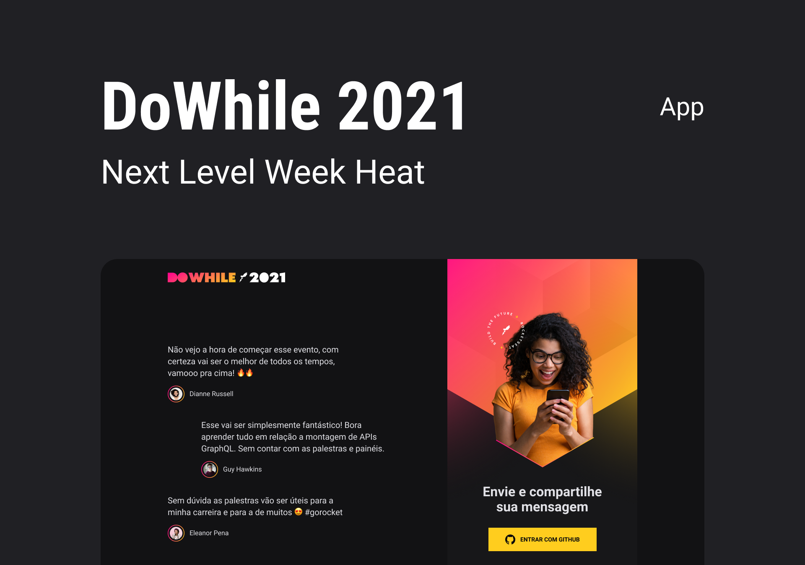

# API DoWhile2021

  <a href="#-projeto">Projeto</a> |
  <a href="#-technologies">Tecnologias</a>

  

## 🔖 Projeto

  API Rest da aplicação <b>DoWhile2021</b>, onde foi desenvolvido um chat em real-time desenvolvido com <b>WebSocket</b> e autenticação com Github.

 

## 🚀 Technologies

* TypeScript
* Prisma
* Axios
* Socket.io
* JWT
